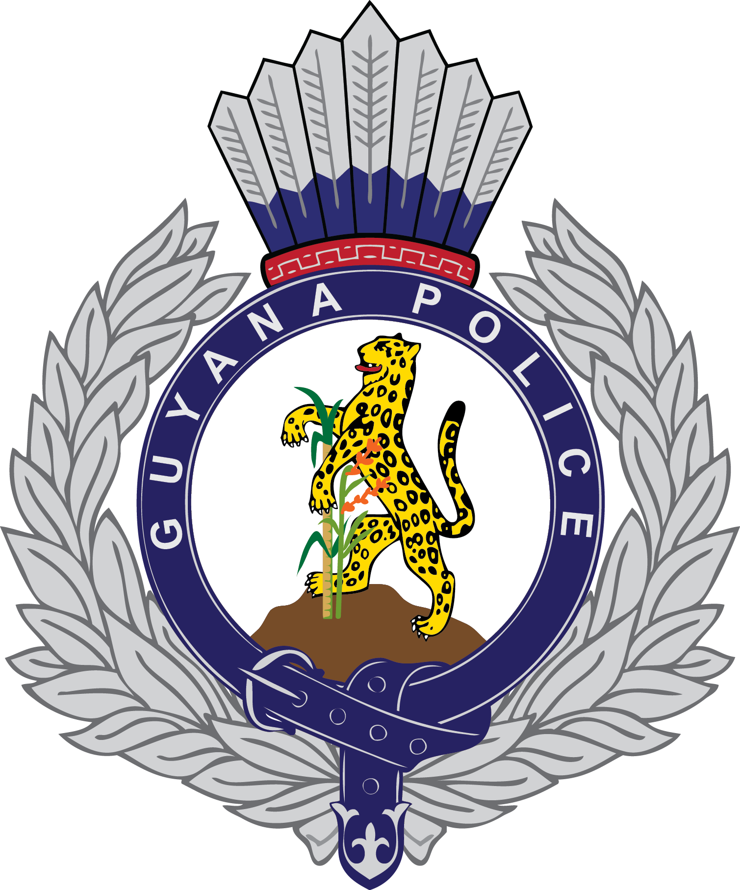

 

# CSE2102-Project-drivesafely <h1> 

## Installation <h2>
To have the webpage up and running, foloow these steps:
1) copy the CSE2102-Application Prototype folder
2) paste it in the www directory on your local drive 
3) start your wamp server
4) paste the appropiate link in the search bar to load webpage

## CSE2102 Project 2018 <h2>
>**Problem Statement**:
The Guyana Police agency has a collection of ticket fines issued to motorist who committed traffic offenses. In an effort to address the recent increase in fatal accidents caused by careless driving the director has launched a project called “Drive Safely” to target 3 major offenses, namely: Speeding, Driving under the Influence of Alcohol and Not Wearing Seat belts. The selected pilot counties are Essequibo, Demerara and Berbice. Currently the department uses a manual system to record and store information relating to issuing of tickets, payment of fines and administration of penalties. They are dissatisfied with this system because it is difficult to identify critical information in a timely manner such as motorists who are to be sanctioned for outstanding unpaid tickets and demerits.

>**Purpose**:
The purpose of creating this Database is to move away from manual system and to implement a technological database to store tickets fines, payment of fines and administration of penalties that are cause by unscrupulous motorists and also to store and maintain the records entered and to output penalties to serve their punishments. The main audience targeted is the users and their clients.

>**Scope**:
This application can be used by any traffic agency in the world to automate the process of manually storing and recording ticket fines, payment of fines and administration of penalties that is issued to any motorist that surrounds three of the major offenses that causes an increase in fatal accidents namely: speeding, Driving under the influence of alcohol and Not wearing seat belts. The system will help manage, maintain and store the records of the motorists and sanction certain punishments based on the offence that is committed.

## Organization Name- Guyana Police Agency <h2>

## Group Members:

| No.|    Name        |   USI   |   Duties      | 
| ---|----------------|---------|---------------|
|  1.| Ibrahim Mohamed  |  1028696 | Documentation 
|  2.| Shamaar Huntley  |  1028670 | User interface
|  3.| Rudolph Adams    |  1026689 | Testing
|  4.| Enrique Ward  	  |  1026794 | Coding
|  5.| Ayancey Barker   |  1025287 | Refactoring 
|  6.| Arvinda Ramcharan| 1021380  | Storage Manager
|  7.| Anthony Daly	    | 1028513  | System Analyst
                              
                                
                                 
                                 
                                
                                   

  
